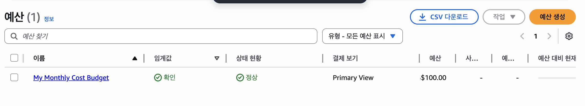
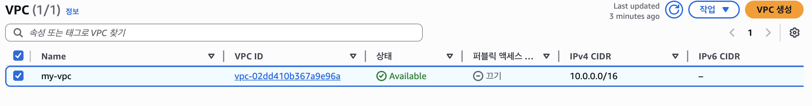
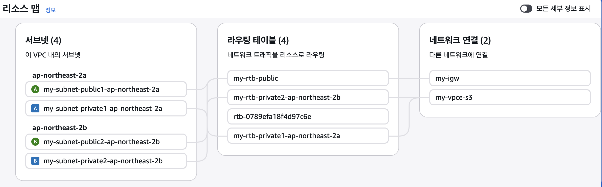
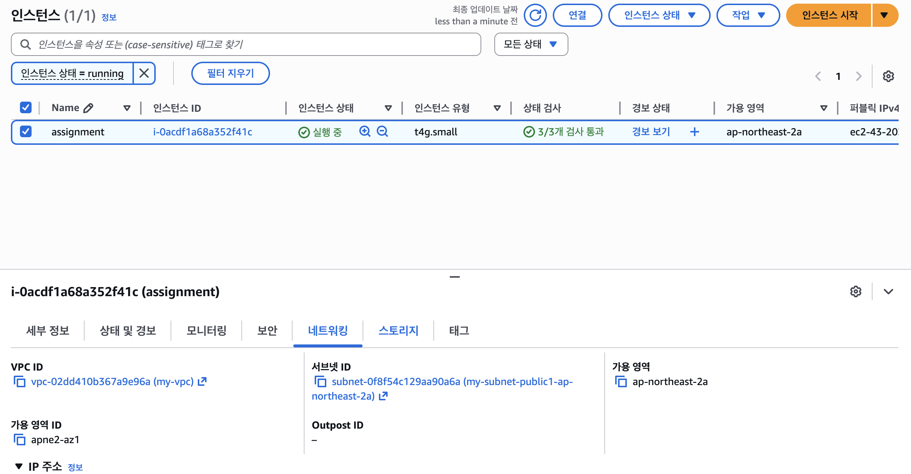
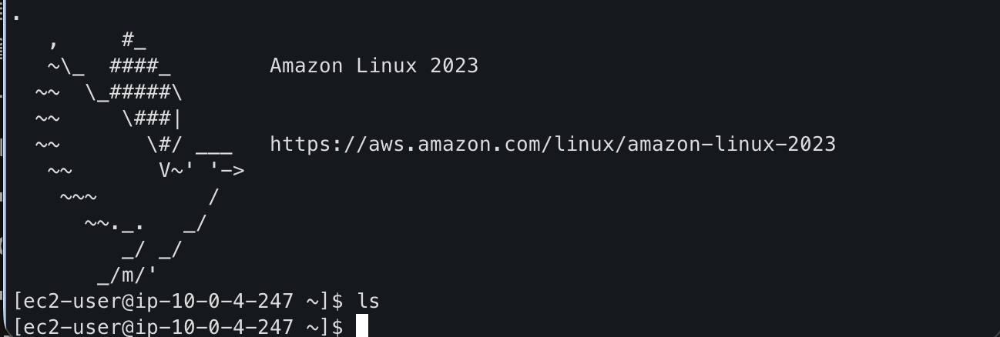
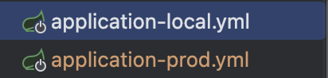
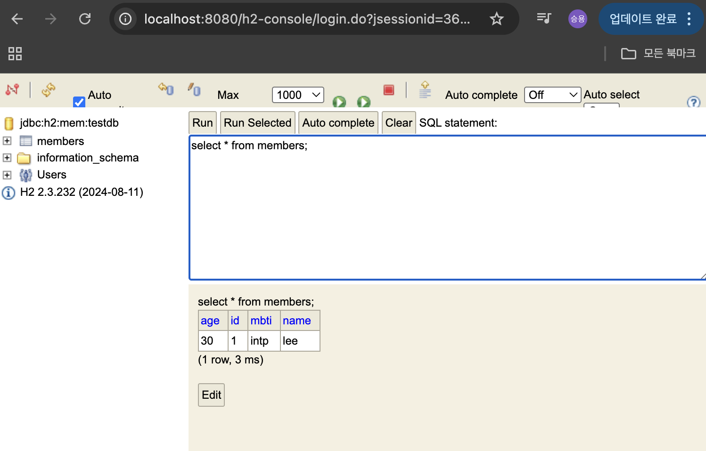
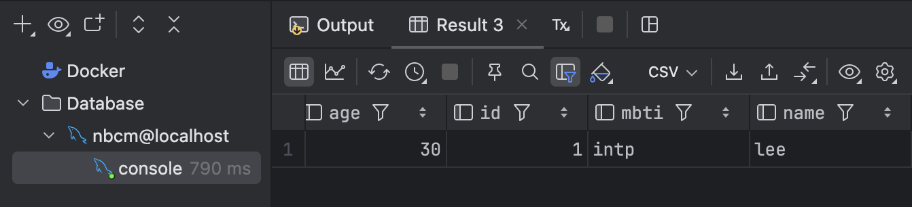

### AWS Budget 설정
AWS Budget 설정을 통해 1달에 최대 한도를 100달러로 설정하였고 비용이 일정치가 되면 경고 이메일이 오도록 하였다.

### 네트워크 구축 및 핵심 기능 배포
#### VPC 설계
VPC는 퍼블릭 클라우드 서비스 내에 논리적으로 격리된 고객 전용 사설 네트워크 공간으로 서브넷 구성, IP 주소 대역 설정,
라우팅 테이블 및 네트워크 게이트웨이 등을 직접 제어하여 고도화된 보안 및 맞춤형 인프라를 구축할 수 있는 서비스이다.

VPC를 설정하여 외부에서 직접 접근이 가능한 네트워크 영역인 public subnet과 외부에서 다이렉트로 접근이 불가능한 private subnet으로 나누었다.

#### EC2 생성
앞에서 설정한 VPC의 public subnet과 연결된 ec2 인스턴스를 생성하였다. 그후 생성된 ec2를 ssh를 사용하여 연결하였다.

#### 팀원 정보 저장 및 조회 API 개발
티원의 이름, 나이, MBTI를 JSON으로 받아 저장하는 API를 개발하였고
저장된 팀원 정보를 조회하는 API를 개발하였다.

#### Profile 분리
로컬환경에선 H2를 쓰고 운영환경에선 MySQL을 쓰도록 하기 위해 application-local.yml, appliaction-prod.yml을 만들었다.

#### 로깅
Controller 단에 요청이 들어오면 INFO 레벨로 로그를 남기도록 하였고
예외발생시 RestControllerAdvice를 사용하여 예외처리를 하도록 하였으며 ERROR 레벨로 스택 트레이스를 남기도록 하였다.

